<div align="center">



<br />

<samp>
  <b>SYED ZARAK HASSAN</b>
  <br />
  GRC · Customer Trust · Security Tooling · Builder
</samp>

<br />
<br />

<samp>
  I work where customer trust, compliance evidence, and security tooling overlap.
</samp>

<br />
<br />

<a href="https://linkedin.com/in/zarak-hassan7">
  
</a>
<a href="https://zarak-os.vercel.app">
  
</a>
<a href="https://github.com/darkyzowo/zarak-os">
  
</a>
<a href="mailto:syedzrk1000@gmail.com">
  
</a>

</div>

---

### `> whoami --brief`

```yaml
name: Syed Zarak Hassan
location: Nottingham, United Kingdom

current_role:
  title: Compliance Analyst
  company: Thrive Learning

education:
  - MSc Cyber Security, Nottingham Trent University
  - BSc Software Engineering, Iqra National University

focus:
  - vendor risk and due diligence
  - customer trust and security assurance
  - compliance operations and process design
  - security tooling and workflow automation

currently_building:
  - VenderScope
  - ContraAI
  - ZARAK_OS
```

---

### `> impact.log`

```txt
[THRIVE]    Manage a 50+ vendor portfolio across onboarding, risk reviews,
            due diligence, and account health.

[DPA]       Redesigned the company-wide DPA tracking process and reduced
            time-to-approval by 70%.

[ISO 9001]  Built six process flows from scratch to support a successful
            Stage 1 audit and make ownership clearer for non-technical teams.

[MDM]       Led a Kandji migration across 250+ endpoints with zero downtime
            and reduced IT support tickets by 40%.

[TRUST]     Support RFIs, security questionnaires, and customer-facing
            technical assurance work.

[NEXIQUE]   Owned 15+ client accounts end-to-end across onboarding,
            delivery, communication, and relationship management.
```

---

### `> ls ./products`

| Product | Why it exists | Stack |
|--------|---------------|-------|
| [**VenderScope**](https://github.com/darkyzowo/venderscope) | Built from the pain of handling vendor risk manually across 50+ vendors. Designed to turn point-in-time reviews into continuous vendor risk intelligence. | JavaScript |
| [**ContraAI**](https://github.com/darkyzowo/contraai) | AI-assisted contract review platform built to make clause analysis faster, clearer, and more structured. | Next.js · Claude API |
| [**ZARAK_OS**](https://github.com/darkyzowo/zarak-os) | Cyber-noir portfolio OS built to present my work like an interactive environment rather than a static site. | TypeScript · Three.js |

---

### `> cat ./operator-profile.txt`

```txt
I am interested in work that sits between:

- customer trust
- compliance evidence
- security operations
- technical onboarding
- process design
- useful internal tooling

That usually means taking something messy,
understanding the people stuck with it,
and building a cleaner way through.
```

---

### `> cat ./stack.txt`

**Security, Trust & Compliance**


**Tools & Platforms**


**Building With**


---

### `> ./snake.sh`

<div align="center">

<picture>
  <source media="(prefers-color-scheme: dark)" srcset="https://raw.githubusercontent.com/darkyzowo/darkyzowo/output/github-contribution-grid-snake-dark.svg" />
  <source media="(prefers-color-scheme: light)" srcset="https://raw.githubusercontent.com/darkyzowo/darkyzowo/output/github-contribution-grid-snake.svg" />
  
</picture>

</div>

---

<div align="center">
  <sub>
    Building at the intersection of security, compliance, customer trust, and product.
    Open to GRC, customer trust, InfoSec, and compliance engineering roles in the UK.
  </sub>
</div>
