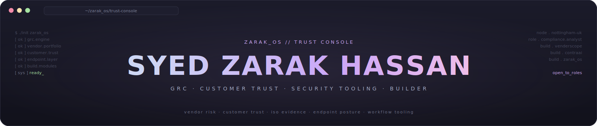

<div align="center">



<samp>I work where customer trust, compliance evidence, and security tooling overlap.</samp>

<br/><br/>

<a href="https://linkedin.com/in/zarak-hassan7">
  
</a>
<a href="https://zarak-os.vercel.app">
  
</a>
<a href="mailto:syedzrk1000@gmail.com">
  
</a>

</div>

---

### `> whoami`

```yaml
name:     Syed Zarak Hassan
location: Nottingham, United Kingdom
role:     Compliance Analyst @ Thrive Learning
study:    MSc Cyber Security, Nottingham Trent University
          BSc Software Engineering, Iqra National University
focus:    GRC · customer trust · security tooling · product thinking
open_to:  GRC · customer trust · technical CSM · security analyst
          · compliance engineering  (UK)
```

---

### `> case-files`

Each row is work I owned, not work I touched.

| File | Problem | What I did | Result |
|---|---|---|---|
| `VENDOR-RISK-50` | Vendor risk was manual, fragmented, point-in-time. | Ran a 50+ vendor portfolio through onboarding, account health, classification, and due diligence. | Stronger oversight. The workflow pain became VenderScope. |
| `DPA-TRACKING` | DPA approvals were slowing procurement. | Redesigned the company-wide tracking process end to end. | Time-to-approval down 70%. |
| `ISO9001-STAGE1` | Process ownership had to be legible to non-technical teams. | Built six ISO process flows from scratch. | Supported a passed Stage 1 audit. |
| `KANDJI-MDM` | Endpoint estate needed a cleaner posture. | Led Kandji MDM migration across 250+ endpoints. | Zero downtime. IT tickets down 40% post-rollout. |
| `CUSTOMER-TRUST-RFI` | A high-value prospect blocked on security assurance. | Mapped controls to their requirements in a readable RFI response. | Helped clear the deal. |
| `NEXIQUE-ACCOUNTS-15` | Client delivery needed structure and clear ownership. | Owned 15+ accounts end to end at Nexique: onboarding, delivery, relationship. | Held near-100% satisfaction across the book. |

---

### `> products`

Built when spreadsheets and screenshots stopped scaling.

**[VenderScope](https://github.com/darkyzowo/venderscope)** &nbsp; Continuous vendor risk intelligence. Pulls live signals from HIBP, NVD/NIST, Shodan, and Companies House, scores them on a weighted model, and produces audit-ready PDFs. Built because annual reviews and forms were the bottleneck, not the answer.

**[ContraAI](https://github.com/darkyzowo/contraai)** &nbsp; AI-assisted contract review. Turns clause playbooks into structured analysis and flags risky, missing, or non-standard terms. The goal is not to replace human review. The goal is to get human review to the right clauses faster.

**[ZARAK_OS](https://github.com/darkyzowo/zarak-os)** &nbsp; A cyber-noir portfolio operating system. Built because a portfolio should show how someone thinks, not just list what they touched.

---

### `> how-i-think`

```txt
Good compliance is not paperwork theatre. It answers four questions:

    what risk exists?
    who owns it?
    what evidence proves the control?
    what changed since the last review?

If the answer takes a week and a spreadsheet, the process is the bug.
```

---

### `> stack`

**Trust and compliance**
ISO 27001 · SOC 2 · GDPR · Cyber Essentials · vendor due diligence · DPA tracking · RFIs and security questionnaires

**Platforms**
Vanta · Jira · Kandji · Pulseway · Splunk · Chronicle SIEM · Bitdefender

**Building with**
TypeScript · Python · Next.js · Claude API · Vercel

---

### `> contribution.snake`

<div align="center">

<picture>
  <source media="(prefers-color-scheme: dark)" srcset="https://raw.githubusercontent.com/darkyzowo/darkyzowo/output/github-contribution-grid-snake-dark.svg" />
  <source media="(prefers-color-scheme: light)" srcset="https://raw.githubusercontent.com/darkyzowo/darkyzowo/output/github-contribution-grid-snake.svg" />
  
</picture>

</div>

---

<div align="center">
<sub>Operating where security, compliance, customer trust, and product meet. Based in the UK.</sub>
</div>
