<div align="center">



<samp>
  I sit between security, compliance, customer trust, and the tools that make all three less painful.
</samp>

<br/>
<br/>

<a href="https://linkedin.com/in/zarak-hassan7">
  
</a>
<a href="https://zarak-os.vercel.app">
  
</a>
<a href="mailto:syedzrk1000@gmail.com">
  
</a>

</div>

---

### `> boot.log`

```bash
$ ./init-zarak-os

[BOOT] Initialising ZARAK_OS...
[ OK ] GRC engine loaded ............. ISO 27001 | SOC 2 | GDPR
[ OK ] Vendor portfolio online ....... 50+ vendors | Vanta | Due diligence
[ OK ] Customer trust mode ........... RFIs | Security questionnaires | Technical assurance
[ OK ] Endpoint layer ready .......... Kandji | MDM | 250+ endpoints
[ OK ] Build modules loaded .......... VenderScope | ContraAI | ZARAK_OS
[SYS ] Ready.
```

---

### `> whoami --brief`

```yaml
name: Syed Zarak Hassan
location: Nottingham, United Kingdom
current_role: Compliance Analyst @ Thrive Learning
education:
  - MSc Cyber Security, Nottingham Trent University
  - BSc Software Engineering, Iqra National University

lane: GRC x Customer Engineering x Security Tooling x Product

what_i_do:
  - translate technical security requirements into clear business action
  - manage vendor due diligence, risk reviews, and compliance evidence
  - support customer trust, RFIs, and security questionnaires
  - build tools when spreadsheets and point-in-time reviews are not enough

currently_building:
  - VenderScope: continuous vendor risk intelligence
  - ContraAI: AI-assisted contract review
  - ZARAK_OS: cyber-noir portfolio operating system
```

---

### `> cat ./impact.log`

```txt
[THRIVE] Managed 50+ vendors through onboarding, account health,
         risk classification, and due diligence workflows.

[DPA]    Redesigned the company-wide DPA tracking process,
         reducing time-to-approval by 70%.

[ISO]    Supported a successful ISO 9001 Stage 1 audit by building
         six process flows from scratch for non-technical teams.

[MDM]    Led a Kandji migration across 250+ endpoints with zero downtime,
         reducing IT support tickets by 40%.

[RFI]    Delivered a high-value prospect RFI by mapping security controls
         to technical and commercial requirements.

[NEXIQUE] Owned 15+ client accounts end-to-end, from onboarding and delivery
          to stakeholder communication and long-term relationship management.
```

---

### `> ./mission.sh`

```txt
Most compliance work breaks down because it lives in PDFs,
spreadsheets, screenshots, long email threads, and forgotten tickets.

I am interested in the opposite:

live risk signals,
clear evidence,
faster reviews,
better onboarding,
and security practices that customers, engineers, and operators can actually use.

The goal is simple:
make trust measurable, useful, and easier to act on.
```

---

### `> ls ./projects --impact`

| Project | Why it exists | Stack |
|---------|---------------|-------|
| [**VenderScope**](https://github.com/darkyzowo/venderscope) | Built from real frustration with managing 50+ vendor audits manually. Monitors vendors across HIBP, NVD/NIST, Shodan, and Companies House, replacing annual reviews with live weighted risk scoring and one-click PDF audit reports. | JavaScript |
| [**ContraAI**](https://github.com/darkyzowo/contraai) | AI-assisted contract review platform that turns contract playbooks into structured clause analysis, helping teams spot risky, missing, or non-standard terms faster. | Next.js · Claude API |
| [**ZARAK_OS**](https://github.com/darkyzowo/zarak-os) | Cyber-noir portfolio OS with a custom desktop, terminal emulator, window system, and interactive interface. Built to feel like an environment, not a static page. | TypeScript · Three.js |

---

### `> cat ./operator-profile.txt`

```txt
I am not trying to be "just GRC" or "just technical".

The work I care about sits between:

customer trust,
security operations,
compliance evidence,
technical onboarding,
process design,
and useful internal tooling.

That usually means taking something messy,
understanding the people stuck with it,
and building a cleaner way through.
```

---

### `> cat ./stack.txt`

**Security, Trust & Compliance**


**Tools & Platforms**


**Building With**


---

### `> ./operating-model`

```txt
vendor risk      -> monitor -> score -> evidence -> better decisions
customer trust   -> RFI -> explain -> assure -> fewer deal blockers
contracts        -> analyse -> flag -> review -> faster turnaround
endpoints        -> posture -> policy -> remediate -> fewer gaps
compliance       -> controls -> proof -> automate -> less spreadsheet pain
```

---

### `> ./snake.sh`

<div align="center">

<picture>
  <source media="(prefers-color-scheme: dark)" srcset="https://raw.githubusercontent.com/darkyzowo/darkyzowo/output/github-contribution-grid-snake-dark.svg" />
  <source media="(prefers-color-scheme: light)" srcset="https://raw.githubusercontent.com/darkyzowo/darkyzowo/output/github-contribution-grid-snake.svg" />
  
</picture>

</div>

---

<div align="center">
  <sub>
    Building at the intersection of security, compliance, customer trust, and product.
    Open to GRC, customer engineering, InfoSec, and compliance engineering roles in the UK.
  </sub>
</div>
